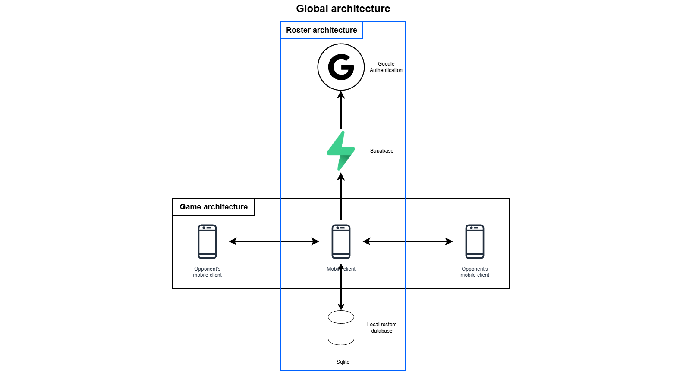

# 📘 Technical Architecture Document (TAD)

## 1. Context and objectives
- **Project name** : Carnage Tracker
- **Description** : Carnage tracker is a mobile app used by Gasland players to build teams and to track game state.
- **Objectives** : Carnage tracker need to be an intuitive and easy-to-use mobile app that helps players to keep tracks of their games.
- **Challenges** : 
  - The app need to be intuitive, easy-to-use and relatively high-performing
  - This app is a side project that I realise on my free time. Therefore, it is not my main activity
  - Technically, this project is used to implement best practicies and improve development skills 
- **Constraints** : 
  - Costs
  - Time development
  - Best practicies
  - Skills improvement
  - Monitoring
  - Need an offline mode

---

## 2. Global architecture

- **Mobile application** : Frontend client used by players to interact with the system
- **Data storage** : Locally, all teams and games are stored locally in a database. But to synchronized data, when an internet connection will be valid, the application will post data to supabase cloud solution.
- **Google authentication** : Service that store and manage users identity through supabase

---

## 3. Technological choices
| Type                | Technologies            | Justifications|
|---------------------|-------------------------|---------------|
| Database            | SQlite                  | File-based, relationnal |
| Data storage        | Supabase                | Open-source, easy to use and documented |
| Mobile              | C# (.NET 9), MAUI       | Cross-platform, improve skills,  |
| Authentication      | JWT / OAuth2            | Security standard |
| CI/CD               | GitHub Actions          | Automate build and deploy|
| App communications  | SignalR and more        | Integrated in the .Net environement|

---

## 4. Software architecture
### 4.1 Clean Architecture
- **Domain** : Business rules, domain entity and Interface.
- **Infrastructure** : Database persistance.
- **View** : Mobile view and interaction.

### 4.2 Main modules
- Authentication
- Roster creation
- Game state tracking

### 4.3 Automated delivery
- **CI/CD** : 
  - *CI* : Build mobile app, run static code analysis, execute unit test and save build apk.
  - *CD* : Deploy automatically apk to app stores

---

## 6. Security
- Authentication : Use OAuth with Google authentication
- Autorisation : Apply permissions on each request to Supabase
- Encryption : HTTPS (TLS 1.2+)
- Secrets management : 

---

## 7. Conventions
- **Naming** : Use the Microsoft naming conventions
- **Code review** : Pull request are mandatory to push new code to dev or main, it will be used to run CI pipeline.
- **Tools** :
  - **StyleCop** : Use to apply naming conventions automatically
  - **CommitLint** : Use to validate code and commit message before commiting
  - **Sonar** : Static code anaylser to improve the code base
  - **SemanticRelease** : Use to automatically increment application version

---

## 8. Test strategy
- **Unit tests** : Test buisiness rules
- **end-to-end tests**

---
